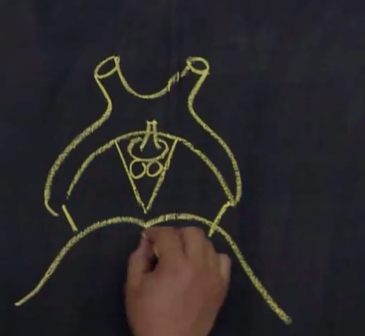

# 首页
## 欢迎来到内测
## 本站为 学生自建 纯公益 指南手册
旨在汇总攻略 帮助学生更轻松地开启南医生活

往届参考：<https://mp.weixin.qq.com/s/f6ub4iCToPvh-3macSwa_w>

## 手机端请点左上角三条杠查看<ins>总目录</ins>
## 快速跳转

* [本站使用说明](更新及说明/本站使用说明.md)
* [新闻公告](新闻速递/基孔肯雅热.md)
* [更新日志](更新及说明/更新日志.md)
* [友情链接](友情链接/引言.md)
* [我要投稿](投稿、后记及测试区/我要投稿.md)

ps:此链接不是最终链接。最终应是https://ILOVESMU.github.io  ，会简洁稍微一点点
哎哟搞了老半天的配色校徽logo目录页脚传不上来
好消息是确实可以实时更新
